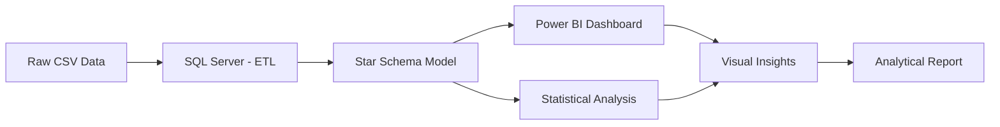

# ScamWatch Data Analysis Project

## Overview

This repository contains the complete analytical workflow for the **ScamWatch Data Analysis Project**, based on ScamWatch datasets from 2020 to 2024. The project includes data cleaning and transformation using SQL Server, development of a star-schema data model, and creation of an interactive Power BI dashboard and a written analytical report.

The objective of this project is to identify emerging scam patterns in Australia, analyse demographic and financial impacts, and present evidence-based findings through business-ready visualisations and documentation.

---

## Repository Contents

### 1. Analytical Report 
**File:** [ScamWatch Data Analysis Report](https://github.com/naychithanshwe/ScamWatchDataAnalysisProject/blob/main/ScamWatch%20Data%20Report.pdf)

This document includes a comprehensive analysis of scam trends, financial loss distribution, demographic impact, and changes in scam contact methods. The report contains:

- Executive summary
- Data processing and methodology
- Visual analytics and narrative insights
- Scam type comparison
- Demographic and regional analysis
- Conclusions

---

### 2. Power BI Dashboard 
**File:** [ScamWatch Data Analysis PowerBI Dashboard PBIX](https://github.com/naychithanshwe/ScamWatchDataAnalysisProject/blob/main/ScamWatch%20Data%20Analysis%20Project.pbix)

**File:** [ScamWatch Data Analysis PowerBI Dashboard PDF](https://github.com/naychithanshwe/ScamWatchDataAnalysisProject/blob/main/ScamWatch%20Data%20Analysis%20Project%20PowerBI%20Dashboard%20in%20PDF.pdf)

An interactive dashboard designed for exploratory and descriptive analysis, including:

- Scam frequency trends across years
- Financial loss over time
- Comparison of scam categories
- Gender and age group segmentation
- State-level financial loss per 100,000 population
- Contact method evolution and emerging patterns

---

### 3. SQL Data Processing Script
**File:** [`ScamWatch Data Analysis Portfolio.sql`](https://github.com/naychithanshwe/ScamWatchDataAnalysisProject/blob/main/SQL/ScamWatch%20Data%20Analysis%20Portfolio.sql)

**File:** [`ScamWatch Data Analysis Portfolio.txt`](https://github.com/naychithanshwe/ScamWatchDataAnalysisProject/blob/main/SQL/ScamWatch%20Data%20Analysis%20Project%20SQL%20file%20in.txt)

This script includes:

- Importing and combining multiple CSV datasets (2020–2025)
- Cleaning and standardising the `Amount_lost` field
- Date formatting and validation
- Duplicate detection
- Data enrichment
- Normalising the dataset
- A final consolidated dataset suitable for BI and analytical reporting

---

## Objectives

The primary objectives of this project are to:

- Identify the most frequent and the most financially damaging scam types
- Understand the demographic groups most affected
- Analyse state-level differences in scam losses
- Examine the shift in scam contact modes from 2020 to 2024
- Deliver a clear, data-driven summary suitable for stakeholders

---

## Key Insights

- **Phishing** is consistently the most commonly reported scam type, accounting for **30.79%** of total reports.
- **Investment scams**, while representing only **3.2%** of reports, contribute more than **52.59%** of total financial losses.
- **Phone call scams** declined significantly after 2021, with **email and SMS** becoming increasingly common contact methods.
- Individuals **aged 55 and above** represent the largest proportion of reports and financial losses.
- **Males** experience higher financial loss compared to females, largely due to disproportionate exposure to investment scams.
- The **Australian Capital Territory** recorded the highest loss per 100,000 population beginning in 2021.

---

## Data Model

The project uses a **star-schema model** to support efficient analytical queries.

### Fact Table

**`FactScamReports`**
- Report date
- Number of reports
- Amount lost
- ScamTypeID
- AgeGroupID
- GenderID
- RegionID
- ContactModeID

### Dimension Tables

- **`DimScamType`** - Scam category classifications
- **`DimAgeGroup`** - Age brackets (Under 18, 18-24, 25-34, 35-44, 45-54, 55-64, 65+, Unspecified)
- **`DimGender`** - Gender classifications
- **`DimRegion`** - Australian states and territories
- **`DimContactMode`** - Contact methods (Email, Phone, SMS, Social Media, etc.)

---

## Tools and Technologies

| Tool | Purpose |
|------|---------|
| **SQL Server Management Studio (SSMS)** | ETL, data cleaning, and dimensional modelling |
| **Power BI Desktop** | Data visualisation and interactive reporting |
| **Excel/CSV** | Data sources |
| **GitHub** | Version control and portfolio presentation |

---

## Project Workflow

## Data Sources

- **Primary:** ScamWatch (Australian Competition and Consumer Commission)
- **Supplementary:** Australian Bureau of Statistics (ABS) - Population data

---

## Accessibility Considerations

Colour palettes were selected using the [Venngage Accessible Colour Palette Generator](https://venngage.com/tools/accessible-color-palette-generator) to support visual accessibility.

**Colour Palette:** #777C6D, #B7B89F, #D6A77A

---

## Contact

**Nay Chi Than Shwe**
- LinkedIn: [https://www.linkedin.com/in/nay-chi-than-shwe-64b653165/]
- Email: [naychithanshwe94@gmail.com]

---
